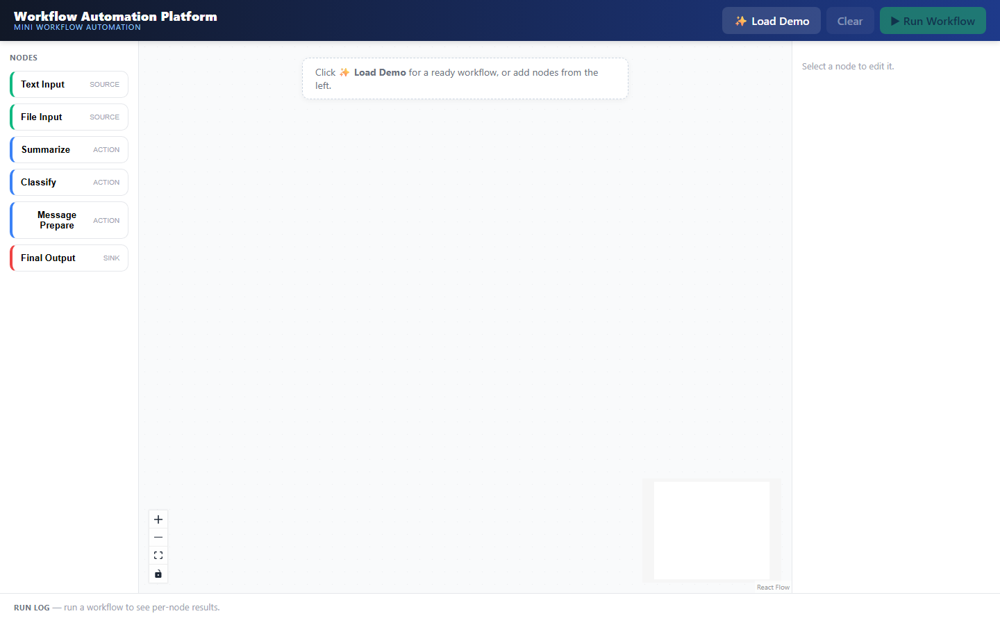
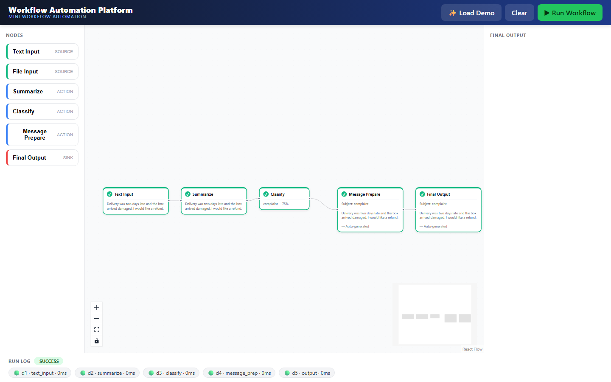
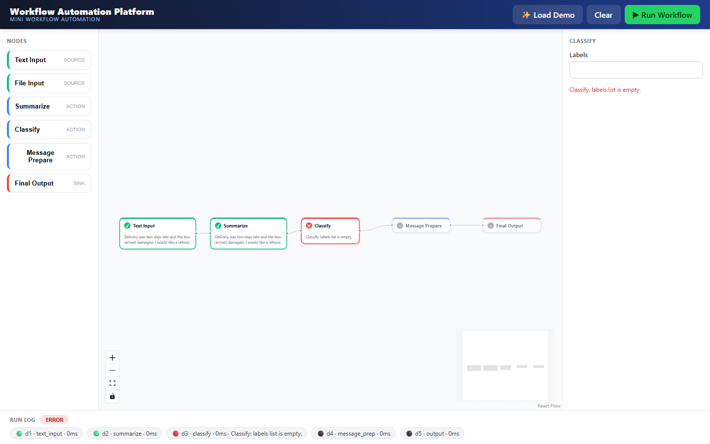

# Workflow Automation Platform

A small, honest version of a workflow-automation tool like n8n / Dify. A user builds a
workflow on a canvas by adding **nodes** (each node is one action), connecting them in order,
and pressing **Run Workflow**. The platform validates the graph, runs the nodes in dependency
order — passing each node's output into the next — and shows the status, output, and any error
for every step.

Built for the Nexta co-op program to learn how these platforms are *designed*, not just how
they look.

## The idea

Think of it as a flowchart you can run. You wire up boxes such as
`Text Input → Summarize → Classify → Message Prepare → Final Output`, click Run, and watch each
box turn green (success), red (error), or grey (skipped) while showing what it produced.

## Features

- **Visual canvas** (React Flow) — drag nodes, connect them, pan/zoom, minimap.
- **✨ Load Demo** — one click builds a complete example workflow, ready to run.
- **6 node types** across source / action / sink, colour-coded in a schema-driven palette.
- **Run Workflow** — per-node status badges (pending / running / success / error / skipped), a
  running-node pulse, animated edges, and a bottom **run log** with timings.
- **AI nodes that run offline** — summarize / classify default to a keyword/extractive `mock`
  backend (no API key, no downloads); switchable to a real LLM or a local model via one env var.
- **Real error handling** — validation errors (cycle, missing start/end) are rejected before
  running; a node that fails is caught, its downstream is skipped, and the app never crashes.
- **Save / load workflows and run history** (JSON storage) via the API.

## System architecture

```
┌────────────────────────────┐        HTTP / JSON        ┌──────────────────────────────┐
│  Frontend (React + Vite)   │  ───────────────────────▶ │  Backend (FastAPI, Python)   │
│  • React Flow canvas       │  POST /workflows/{id}/run  │  • REST API                  │
│  • node palette + config   │                            │  • Execution engine:         │
│  • Run Workflow button     │  ◀─────────────────────── │      validate → topo-sort    │
│  • per-node status + output│      run record (JSON)     │      → run in order          │
│  • run log                 │                            │  • node registry (6 types)   │
└────────────────────────────┘                            │  • JSON storage (workflows,  │
                                                          │    runs)                     │
                                                          └──────────────────────────────┘
```

Core objects:

- **Node** — one unit of work with a uniform contract: `execute(inputs, config) -> outputs`.
  All node types share it, so the engine runs any node generically.
- **Edge** — a directed connection carrying one node's output into the next node's input.
- **Workflow** — nodes + edges, i.e. a directed acyclic graph (DAG).
- **Run / NodeRun** — the execution record: per-node status, output, error, timing, and logs.

The execution engine is pure Python with no web-framework imports, so it is unit-testable in
isolation and could be driven by a different UI without changes.

## How nodes work

Every node declares its `type`, `category` (source / action / sink), input and output ports,
and a parameter schema (which drives the config panel in the UI). It implements a single
`execute(inputs, config, log)` method that reads its inputs plus configuration, returns a dict
of outputs, and raises `NodeError` with a clear message on failure.

| Node | Category | Reads | Produces |
|------|----------|-------|----------|
| Text Input | source | — | `text` |
| File Input | source | uploaded file (txt/md/csv/pdf) | `text`, `filename` |
| Summarize | action | `text` | `summary` |
| Classify | action | `text` / `summary` | `label`, `confidence` |
| Message Prepare | action | `summary`, `label` | `message` (filled template) |
| Final Output | sink | any upstream value | `result` |

The AI nodes (Summarize, Classify) run through a provider abstraction with three backends,
selected by the `PROVIDER` environment variable:
`mock` (default, fully offline — no API key or model download), `anthropic` (official SDK), or
`local` (Hugging Face transformers). The node code calls one interface and never depends on
which backend answers, so the whole project runs out of the box.

## How workflows are executed

1. **Validate** the graph — every edge points at a real node, required config is present, the
   workflow has at least one start and one end, and there are no cycles.
2. **Topological sort** (Kahn's algorithm) computes a valid execution order from the edges. A
   leftover node means a cycle, which is reported.
3. **Run in order** — for each node, gather its inputs from upstream outputs, execute it, and
   record status, output, timing, and logs. Data accumulates along the path, so a node sees the
   context produced by everything before it.
4. **Error handling** — if a node raises, it is recorded as `error`, its downstream nodes are
   marked `skipped`, and the run continues without crashing. Independent branches still run.
5. The API returns the full run record, which the UI renders as per-node status badges and a
   run log.

## Running the project

### Backend (Python 3.11+)

```bash
cd backend
python -m venv .venv
source .venv/Scripts/activate      # Windows Git Bash; use .venv/bin/activate on macOS/Linux
pip install -r requirements.txt
uvicorn app.main:app --reload --port 8000
```

Interactive API docs: `http://localhost:8000/docs`.
With the default `PROVIDER=mock` no API key or model download is needed.

Run the engine tests (no dependencies required):

```bash
cd backend
python -m unittest discover -s tests -t .
```

### Frontend (Node 18+)

```bash
cd frontend
npm install
npm run dev                         # http://localhost:5173
```

## Project structure

```
backend/   FastAPI app + the pure-Python execution engine + tests
frontend/  React + Vite + React Flow canvas
docs/      demo workflow + screenshots
```

## What is intentionally left out (and how it would scale)

This is a single-process, sequential prototype. A production system (n8n, Dify) adds a job
queue and worker pool (e.g. Redis) for parallel and horizontal execution, authentication and
multi-tenancy, and richer control-flow nodes (branching, loops). The engine here is structured
so those are additive rather than rewrites.

## Demo

The canonical demo workflow (`docs/demo-workflow.json`) turns a customer message into a routed
email draft: `Text Input → Summarize → Classify → Message Prepare → Final Output`. Load it with
one click via **✨ Load Demo**.

### Screenshots

**Empty canvas** — the palette on the left, an empty React Flow canvas, and the config /
run-log panels waiting for a workflow.



**Successful run** — all 5 nodes complete (green check, green border), the Final Output panel
shows the generated message, and the run log at the bottom reports `SUCCESS` with a per-node
timing breakdown.



**Error handling** — the Classify node fails validation (`labels list is empty`, shown both on
the node and in the config panel), its downstream nodes (Message Prepare, Final Output) are
marked `skipped` instead of running, and the run log reports `ERROR` with the exact failure
message — the app never crashes.



## References

- React Flow / xyflow — https://reactflow.dev/
- n8n workflow concepts — https://docs.n8n.io/workflows/
- Dify — https://github.com/langgenius/dify
- Topological sort / DAG execution — Kahn's algorithm
